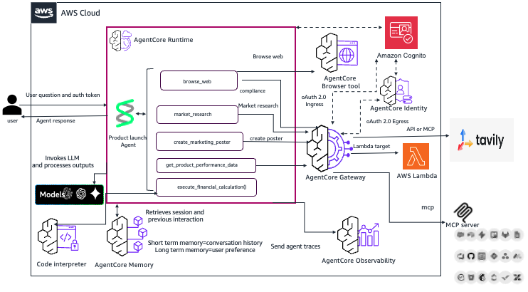

# Product Launch Agent using Amazon Bedrock AgentCore and Strands

**Author**: Neelam Koshiya | [LinkedIn](https://www.linkedin.com/in/neelam-koshiya-3b8407120/)

This workshop demonstrates building a production-ready AI agent system for financial product launches using Amazon Bedrock AgentCore and the Strands framework. The agent helps product managers automate market research, competitive analysis, and launch planning by orchestrating specialized tools through a secure, scalable architecture. You'll progress from a basic prototype to a fully deployed system with persistent memory, centralized tool sharing via an API gateway, containerized runtime with observability, and a web interface secured by Amazon Cognito authentication.

## Workshop Overview

Learn how to build, deploy, and scale an AI agent from prototype to production. This workshop uses a **Financial Product Launch Agent** as the example use case, helping product managers analyze markets, track competitors, and plan product launches.



The AWS Bedrock AgentCore Runtime architecture demonstrates a sophisticated multi-layered approach to building intelligent agent systems that can interact with users, execute complex workflows, and integrate with external services. At its core, the system uses a Product Launch Agent that orchestrates multiple specialized tools including web browsing, market research, poster creation, product performance data retrieval, and financial calculations. The agent leverages large language models to process user queries and determine which tools to invoke, creating a flexible and extensible framework for automating business processes. The runtime environment provides essential capabilities like code interpretation and memory management, allowing agents to maintain conversation context and execute custom logic dynamically.

The authentication and gateway layer showcases AWS's enterprise-grade security and integration capabilities. User requests flow through Amazon Cognito for identity management, with OAuth 2.0 handling secure authentication via ingress and egress pathways. The AgentCore Gateway serves as the central routing mechanism, directing requests to appropriate backend services including AWS Lambda functions for serverless compute and integration with third-party services like Tavily for enhanced search capabilities. This architecture supports both API-based and Model Context Protocol (MCP) integrations, providing flexibility in how external services connect to the agent system. The browser tool integration demonstrates how agents can interact with web content in real-time, enabling dynamic information gathering and task execution.

The observability and monitoring infrastructure built into AgentCore ensures production-ready deployments with comprehensive tracing and debugging capabilities. Agent traces flow through the observability layer to MCP servers, providing detailed insights into agent behavior, tool invocations, and decision-making processes. The system maintains both short-term conversation history and long-term memory through AgentCore Memory, allowing agents to learn from past interactions and maintain user preferences across sessions. This architecture supports stateless agent operations while still providing rich contextual awareness, making it suitable for scalable cloud deployments where agents need to handle multiple concurrent users while maintaining personalized experiences.

### What You'll Build

A complete AI agent system with:
- **Custom Tools**: Product details, market data, competitive intelligence
- **Persistent Memory**: Remember conversations and extract insights
- **Centralized Gateway**: Share tools across multiple agents
- **Production Runtime**: Scalable, observable container deployment
- **Web Interface**: Secure user interface with authentication

## Lab Structure

### [Lab 1: Create Agent Prototype](lab-01-create-agent.ipynb)
**Duration**: 30 minutes

Build a functional product launch agent with three tools:
- `market_research()` - Market analysis with Tavily API
- `browse_web()` - Competitive intelligence gathering
- `create_marketing_poster()` - Marketing materials with Nova Canvas

**What You'll Learn**:
- Creating agents with Strands framework
- Defining and using tools
- Testing agent interactions
- Understanding agent capabilities

**Approach**: Single agent with multiple tools (simple, production-ready)

**Prerequisites**:
- AWS Account with Bedrock access
- Python 3.10+
- Claude 3.7 Sonnet enabled in Bedrock
- Tavily API Key


---

### [Lab 2: Add Memory](lab-02-add-memory.ipynb)
**Duration**: 45 minutes

Add persistent memory to enable cross-session continuity and personalization.

**What You'll Learn**:
- Creating AgentCore Memory resources
- Short-term vs long-term memory strategies
- Seeding historical conversations
- Integrating memory with Strands hooks
- Testing memory recall

**Key Concepts**:
- **Short-Term Memory (STM)**: Immediate conversation context
- **Long-Term Memory (LTM)**: Extracted patterns and preferences
- **Memory Strategies**: USER_PREFERENCE and SEMANTIC
- **Namespaces**: Multi-tenant memory isolation

---

### [Lab 3: Scale with Gateway & Identity](lab-03-add-gateway.ipynb)
**Duration**: 45 minutes

Deploy centralized tool management and secure access control.

**What You'll Learn**:
- Deploying AgentCore Gateway
- Registering tools with Gateway
- Creating agents with Gateway tools
- Understanding identity and access control

**Benefits**:
- Tool reusability across agents
- Centralized tool updates
- Enterprise API integration
- Secure tool execution

---

### [Lab 3i: Browser Automation (Optional)](lab-03i-add-browser.ipynb)
**Duration**: 30 minutes

Add browser automation for competitive research using Playwright and AgentCore Browser.

**What You'll Learn**:
- Connecting Playwright to AgentCore Browser
- Automating competitor website research
- Extracting real-time pricing data
- Capturing screenshots for verification

**Use Cases**:
- Automated competitor rate monitoring
- Live market intelligence gathering
- Product feature comparison

---

### [Lab 3ii: Financial Analysis with Code Interpreter (Optional)](lab-03ii-add-code-interpreter.ipynb)
**Duration**: 30 minutes

Add code execution capabilities for financial calculations and data analysis.

**What You'll Learn**:
- Using AgentCore Code Interpreter
- Executing Python for financial calculations
- Analyzing pricing strategies
- Generating ROI projections

**Use Cases**:
- Loan payment calculations
- Break-even analysis
- Market data statistical analysis
- Revenue modeling

---

### [Lab 4: Deploy to Production](lab-04-add-runtime.ipynb)
**Duration**: 60 minutes

Deploy your agent to production with AgentCore Runtime.

**What You'll Learn**:
- Building Docker containers for agents
- Pushing images to Amazon ECR
- Deploying AgentCore Runtime
- Testing production endpoints
- Monitoring with CloudWatch

**Production Features**:
- Auto-scaling infrastructure
- Built-in observability
- VPC security isolation
- Health checks and recovery

---

### [Lab 5: Build User Interface](lab-05-add-frontend.ipynb)
**Duration**: 45 minutes

Create a web application for users to interact with your agent.

**What You'll Learn**:
- Deploying API Gateway with Cognito
- Building React frontend
- Implementing authentication flow
- Testing end-to-end system

**Architecture**:
- React app (S3/CloudFront)
- API Gateway (public endpoint)
- Lambda (SigV4 proxy)
- Cognito (authentication)

---

### [Lab 6: Cleanup Resources](lab-06-cleanup.ipynb)
**Duration**: 15 minutes

Clean up all AWS resources to avoid ongoing charges.

**What Gets Deleted**:
- CloudFormation stacks
- AgentCore Memory
- ECR images
- SSM parameters
- CloudWatch logs

---

## Getting Started

### ⚠️ Important Security Notices

**This is a workshop/educational project. Before deploying:**

1. **Testing Environment Only**: Deploy in non-production AWS accounts or sandbox environments
2. **No Sensitive Data**: Do not use real customer data, PII, or confidential business information
3. **Lower Environments**: Test in development/staging environments before any production consideration
4. **Data Classification**: Only use synthetic or publicly available data for testing
5. **Access Controls**: Ensure proper IAM policies and network security groups are configured
6. **Cost Management**: Monitor AWS costs and set up billing alerts
7. **Cleanup**: Always run Lab 6 (Cleanup) to remove resources when finished
8. **Security Review**: Conduct security review and penetration testing before any production use
9. **Compliance**: Ensure compliance with your organization's security policies and regulatory requirements

### Prerequisites

1. **AWS Account** with appropriate permissions
2. **Python 3.10+** installed locally
3. **AWS CLI** configured with credentials
4. **Docker** installed (for Lab 4)
5. **Node.js** installed (for Lab 5)
6. **Anthropic Claude 3.7** enabled in Amazon Bedrock

### Installation

```bash
# Clone the repository
cd product-launch-agent

# Set up environment variables
cp .env.example .env
# Edit .env and add your Tavily API key:
# TAVILY_API_KEY=tvly-your-key-here

# Install Python dependencies
pip install -r requirements.txt

# Start Jupyter
jupyter notebook
```

**Get Tavily API Key:**
1. Sign up at https://tavily.com
2. Copy your API key
3. Add to `.env` file: 
   ```bash
   echo "TAVILY_API_KEY=tvly-your-key-here" > .env
   ```
   (Replace `tvly-your-key-here` with your actual API key)

### Recommended Path

**Core Labs** (Required): 1 → 2 → 3 → 4 → 5 → 6

**Optional Labs**: 
- Lab 3i (Browser Automation) - Add after Lab 3 if you need competitive research automation
- Lab 3ii (Code Interpreter) - Add after Lab 3 if you need financial calculations

Follow the core labs in order for the best learning experience. Each lab builds on the previous one.

## Architecture Evolution

### Lab 1: Local Prototype
```
[Agent] → [Local Tools] → [LLM]
```

### Lab 2: With Memory
```
[Agent] → [Local Tools] → [LLM]
   ↓
[AgentCore Memory]
```

### Lab 3: With Gateway
```
[Agent] → [AgentCore Gateway] → [Shared Tools]
   ↓
[AgentCore Memory]
```

### Lab 4: Production Runtime
```
[AgentCore Runtime] → [AgentCore Gateway] → [Shared Tools]
   ↓
[AgentCore Memory]
```

### Lab 5: Complete System
```
[React UI] → [API Gateway] → [Lambda] → [AgentCore Runtime]
                                              ↓
                                    [AgentCore Gateway]
                                              ↓
                                    [AgentCore Memory]
```

## Key Technologies

- **[Amazon Bedrock AgentCore](https://aws.amazon.com/bedrock/agentcore/)**: Managed service for deploying AI agents
- **[Strands Agents](https://strandsagents.com/)**: Code-first agent framework
- **[Anthropic Claude 3.7](https://www.anthropic.com/claude)**: Foundation model
- **AWS Services**: Lambda, API Gateway, Cognito, CloudWatch, ECR

## Use Case: Financial Product Launch

This workshop uses a financial product launch scenario where product managers need to:
- Analyze market trends and competitive landscape
- Track product details and launch timelines
- Research competitor offerings
- Make data-driven launch decisions

The agent helps by:
- Providing instant access to product information
- Analyzing market data and trends
- Gathering competitive intelligence
- Remembering previous discussions
- Maintaining context across sessions

## Cost Considerations

Running these labs will incur AWS charges. Estimated costs:
- **AgentCore Runtime**: ~$0.0007 per session (consumption-based: CPU + memory)
- **AgentCore Memory**: ~$0.005 per session (events + storage + retrieval)
- **AgentCore Gateway**: ~$0.00008 per session (API invocations + search)
- **Bedrock API calls**: ~$0.01-0.05 per request
- **Other services**: Minimal (Cognito, Lambda, DynamoDB, S3)

**Monthly estimates**: $7-630 depending on usage (1K-100K sessions). See [COST.md](COST.md) for detailed breakdown.

**Important**: Run Lab 6 (Cleanup) when finished to avoid ongoing charges.

## Troubleshooting

### Common Issues

**Memory creation fails**:
- Check IAM permissions for AgentCore
- Verify region supports AgentCore Memory
- Wait 2-3 minutes for resource provisioning

**Runtime deployment fails**:
- Ensure Docker image is pushed to ECR
- Check VPC and subnet configuration
- Verify IAM role permissions

**Frontend authentication fails**:
- Confirm Cognito user pool is created
- Check user email verification
- Verify API Gateway CORS settings

### Getting Help

- Check CloudWatch logs for detailed error messages
- Review CloudFormation stack events
- Consult [AgentCore documentation](https://docs.aws.amazon.com/bedrock-agentcore/)

## Additional Resources

- [AgentCore Developer Guide](https://docs.aws.amazon.com/bedrock-agentcore/latest/devguide/)
- [Strands Agents Documentation](https://strandsagents.com/latest/)
- [Amazon Bedrock User Guide](https://docs.aws.amazon.com/bedrock/)
- [Reference Tutorials](../../01-tutorials/07-AgentCore-E2E/)

---

## Advanced: Multi-Agent Architecture (Optional)

The labs use a **single agent with multiple tools** approach for simplicity and production readiness. However, the project includes a **multi-agent system** for complex workflows:

**Multi-Agent System Components:**
- Market Research Agent - Specialized in market analysis
- Compliance Agent - Regulatory requirements
- Strategy Agent - Launch strategy development
- Marketing Agent - Campaign creation
- Deployment Agent - Product deployment
- Orchestrator Agent - Coordinates all agents

**When to Use Multi-Agent:**
- Complex workflows requiring specialized expertise
- Parallel task execution across domains
- Clear separation of concerns needed
- Large teams with domain specialists

**How to Use:**
```python
from lab_helpers.ai_multi_agent_system import get_ai_orchestrator_agent

orchestrator = get_ai_orchestrator_agent()
response = orchestrator("Launch a new auto loan product...")
```

**Trade-offs:**
- **Single Agent**: Simpler, faster, easier to maintain, production-ready
- **Multi-Agent**: More complex, better for specialized domains, requires coordination

For most use cases, the single agent approach in the labs is recommended.

## Support Files

- `lab_helpers/`: Utility functions for labs
- `scripts/`: Helper scripts for deployment
- `requirements.txt`: Python dependencies
- `deployment/`: CloudFormation templates

## Next Steps

After completing the workshop:
1. Customize tools for your specific use case
2. Add more memory strategies
3. Integrate with enterprise APIs
4. Set up CI/CD pipelines
5. Configure monitoring and alarms
6. Implement additional security controls

## License

This project is provided as-is for educational purposes.

## Contributing

We welcome contributions! Please see our Contributing Guidelines for details on:

- Adding new samples
- Improving existing examples
- Reporting issues
- Suggesting enhancements

## License

This project is licensed under the Apache License 2.0 - see the LICENSE file for details.
